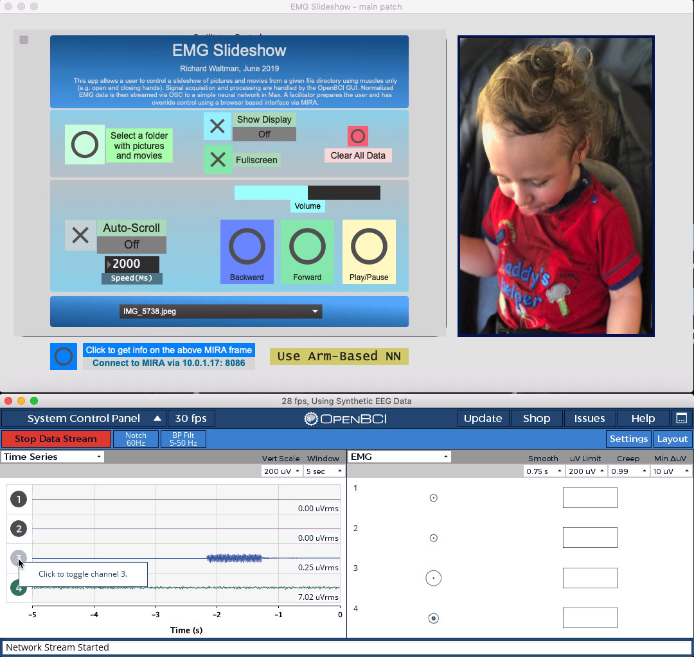

# EMG Slideshow

This app allows a user to control a slideshow of pictures and movies from a given file directory using muscles only (e.g. open and closing hands). Signal acquisition and processing are handled by the OpenBCI GUI. Normalized EMG data is then streamed via OSC to a simple neural network in Max. A facilitator prepares the user and has override control using a browser based interface via MIRA.



## Getting Started

These instructions will get you a copy of the project up and running on your local machine for development and testing purposes. See deployment for notes on how to deploy the project on a live system.

### Prerequisites

What things you need to install the software and how to install them

```
Give examples
```

### Installing

A step by step series of examples that tell you how to get a development env running

Say what the step will be

```
Give the example
```

And repeat

```
until finished
```

End with an example of getting some data out of the system or using it for a little demo

## Deployment

Install the OpenBCI GUI to connect with hardware, then stream the data to this app using Open Sound Control (OSC) via the Networking Widget.

## Built With

* [Max/MSP](https://cycling74.com/) - Visual Programming Language


## Versioning

We use [SemVer](http://semver.org/) for versioning. For the versions available, see the [tags on this repository](https://github.com/retiutut/emg_slideshow/tags). 

## Authors

##### Created by Richard Waltman, June 2019

## License

This project is licensed under the MIT License - see the [LICENSE.md](LICENSE.md) file for details

## THINGS I INSTALLED:
* ml.star (Max package manager)
